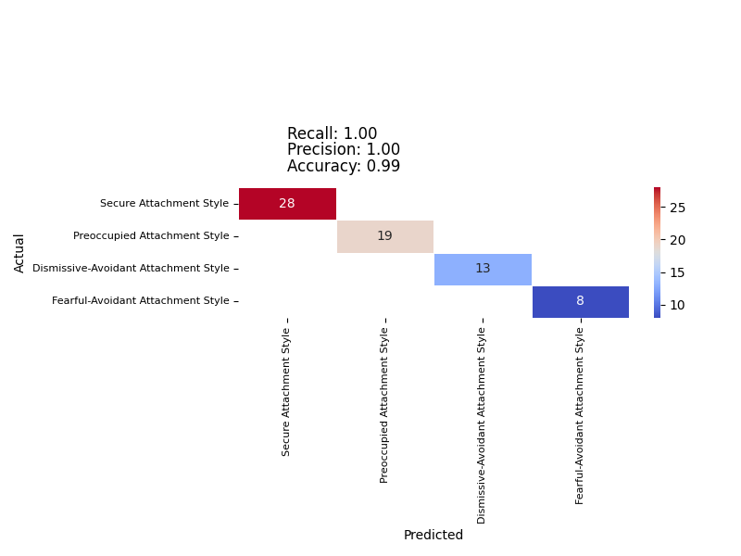
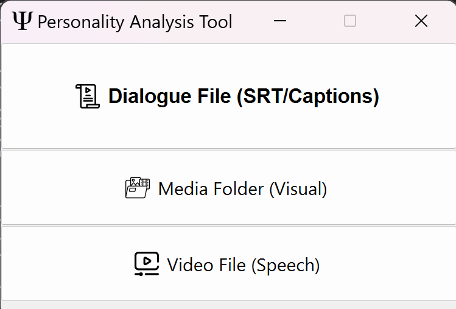
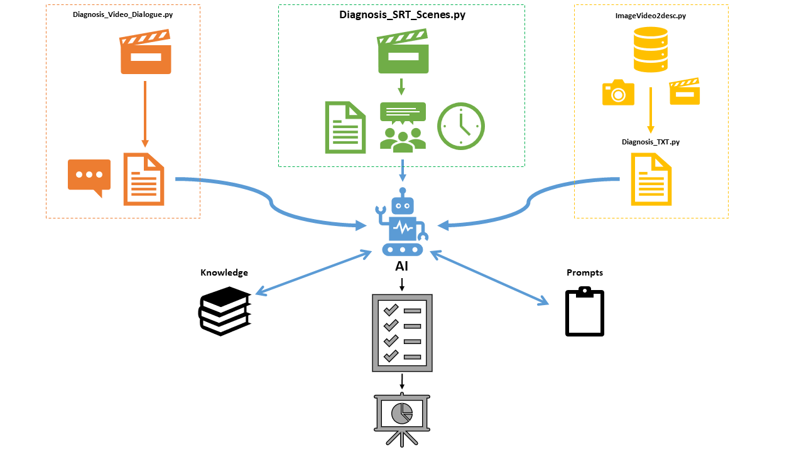
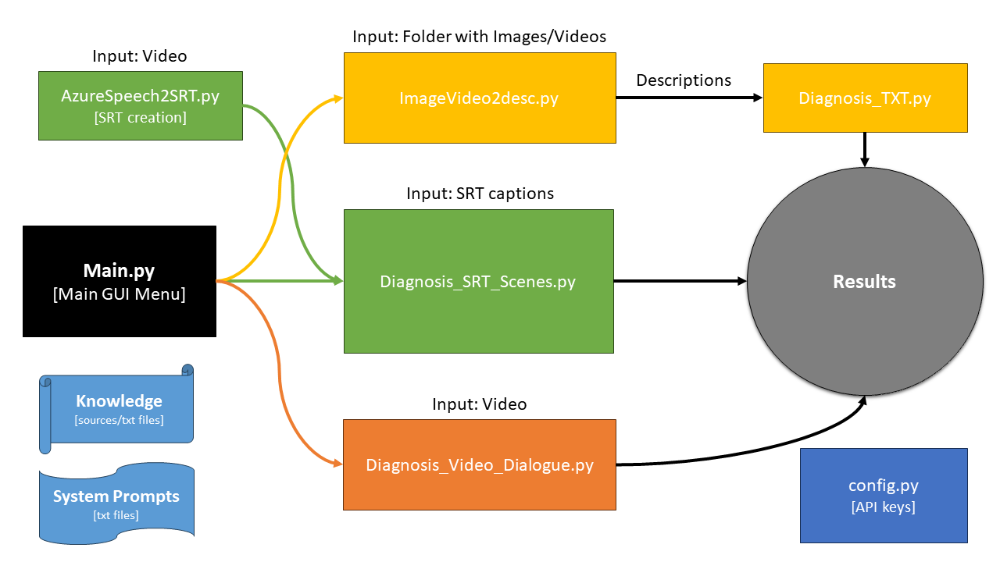
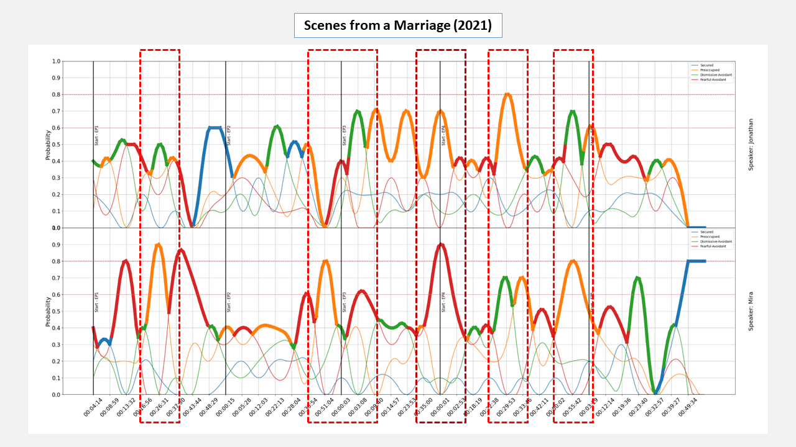
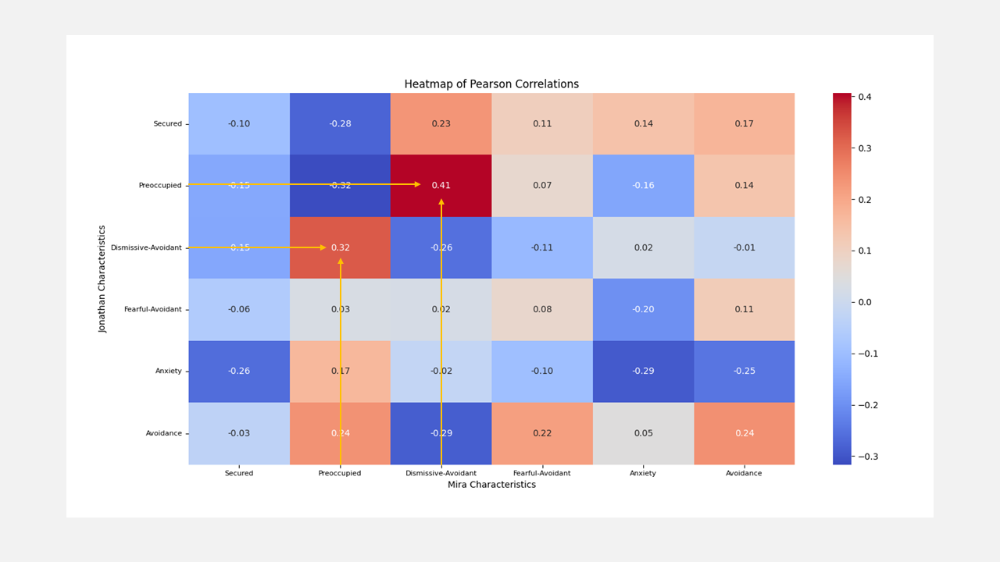
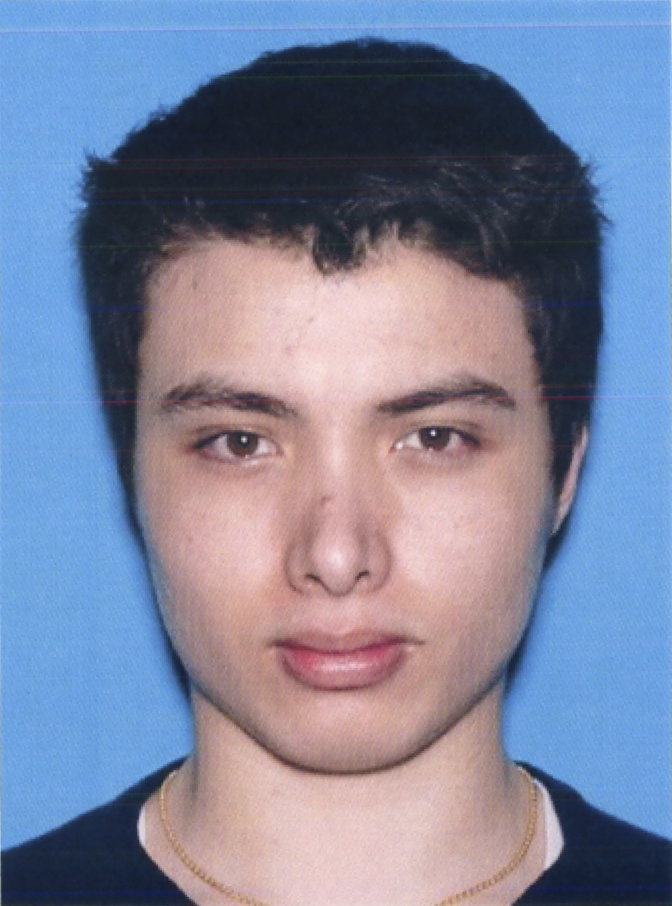

<p align="center">
  
</p>
 
# Automatic Classification of Personality
The purpose of this work is the development of an automatic tool for measuring attachment styles, personality patterns and traits for forensic, intelligence gathering, marketing, and research purposes.

Link for the article: https://drive.google.com/file/d/1hkgxsK11Fl84yzdYji070ke6UqKsaqol/view?usp=drive_link
## Description
The purpose of this work is the development of an automatic tool for measuring attachment styles and personality patterns, that is, according to attachment theory, Shedler-Westen Personality Taxonomy, and the Big Five traits. This work presents the development of an innovative automatic tool designed for the analysis of attachment styles, personality patterns and traits. Criticizing existing diagnostic methods for biases and inefficiencies, the study introduces a novel AI-based tool that employs natural language processing to perform remote, dynamic, and unbiased analysis of attachment and personality patterns.   
* Some of the examples here demonstrate the tool's capability to accurately classify text into distinct attachment styles and personality patterns. This is evidenced by its successful application in analyzing dialogues where it identified correlations between characters attachment styles over time. The tool's effectiveness is further corroborated by a 100% accuracy rate in classifying sentences from established questionnaires into correct attachment styles, showcasing its potential to transform the understanding and assessment of psychological constructs in a more efficient and unbiased manner.   
* Classifying the text into one of the four attachment styles for example is a process which mainly includes the use of the GPT language model. To begin the classification process, the model receives the transcribed text from the episode or series. The text is actually the dialogues that take place between the characters in the serieswhere each sentence in the text belongs to a certain character and is marked as such in advance. Along with the dialogue, the model also receive  Bartholomew's definitions of the four attachment  styles as an input for example. After defining the input it reads the dialogues, paying close attention to what each character says, to the emotional context and the style of attachments that they express - all this based on the defined article.

### Validation:
The model based on its understanding of the dialogues and  the attachment styles determines how well each attachment style fits the way each character speaks. It does this by calculating a probability score that ranges from 0 to 1 for each of the four attachment styles. A score of 1 means that the character's dialogues or text fully matches a certainat attachment  style, while a score of 0 means that there is no match at all. All this he analyzes each segment separately andindependently (The number of segments is predefined) – In the end, each character is assigned a specific attachment style based on their dialogues. This output (fetched to a data file) can then be visualized on a graph, showing the change in styles during the episode or series. 
We would also like to validate the model to check that it works as expected. In this case we check if the model can correctly classify sentences into the correct  attachmentstyles  we use sentences or items from questionnaires (The ASQ and the RSQ for example). In total we have 68 sentences or items, each of which corresponds to one of the four attachment styles. Then we ask the model to classify these sentences or items. The model reads each sentence or item and indicates which attachment style itbelieves the sentence is best suited to . Now we will compare the classifications of the model with the actual classifications known from the questionnaire. We do this using the Confusion Matrix which is a table that helps us understand and evaluatethe performance of the classification model. If the classification capabilities of the model are good, it must classify most (or all) of the sentences or items correctly. In  our case  itcorrectly classified all 68 sentences (100%). 

<p align="left">
  
</p>


## Main GUI and Options:
<p align="left">
  
</p>

It is possible to analyze different types of inputs. The personality patterns analysis can be performed in three ways: one option is an analysis of scenes and dialogues of multiple speakers, a second option is analyzing media contents concentrated in a folder, and a third option is of analyzing a single video file. 

<p align="left">
  
</p>


<p align="left">
  
</p>

### Dialogue File:
1. We start with a video file or a movie from which we want to extract dialogues. Through a transcription process, we convert the auditory speech of the characters into text. This transcribed dialogue will serve as the primary input for our analysis. this is mainly done with AzureSpeech2SRT.py that can perform speaker diarization to recognize different speakers from audio.
2. Then we insert the transcribed dialogue into the GPT model, alongside Bartholomew's definitions of attachment styles from the article - Attachment styles among young adults: A test of a four-category model (1991).
3. The model calculates the probability of each piece or segment of dialogue or text for each of the four  attachment styles. The number of segments is predefined (less segments = analysis of more text per segment).
4. We instruct the model to produce a specific output. In this case, for each piece of dialogue or text, we want the model to assign each speaker or character a probability (from 0 to 1) for each attachment style. A score of 1 means that the dialogue perfectly matches a particular attachment style, and 0 means that there is no match at all.
5. After processing all parts of the dialog or text, the model produces a data set such as a CSV file that includes the probabilities for each attachment style for each part of the dialog or text. This data can then be visualized on a graph to examine changes in attachment styles over the film's timeline. This way we will get a dynamic description of the attachment styles of the characters during the film.

### Results: Scenes From A Marriage (Attachment Styles)
After receiving a data file of the results for the series, we would like to make a comparison between time points or dialogue segments in the series between the main characters. We can also see this graphically, by calculating correlations between the speakers and their attachment style at time points in the film. Correlations (Pearson or Spearman) were calculated between all attachment styles separately for character number 1, and all other attachment styles of character number 2 at all time points in the series. For example, we consider a correlation between the probabilistic values of anxious attachment for character number 1, and the probabilistic values of avoidant attachment for character number 2. In other words, we would like to check whether as the probability value in the series of anxious attachment for character number 1 increases, the probability of avoidant attachment for character Number 2 also increases.
Having run the algorithm on the whole series with 5 episodes, we now want to examine the results. we can see the graphs of each character separately in the attached image. The top graph belongs to Jonathan, while the bottom graph belongs to Mira. This graph shows a distribution of about 25 segments. The timecodes can be seen on the X-axis, with each segment of dialogue corresponding to a timecode. In each timecode there are probabilistic values of the call styles on the Y-axis. The highest values at a time point are highlighted with a thicker line. we can see that each color corresponds to an attachment style. The red markings describe the overlap in time points between the two characters and their attachment styles. It can be seen that when Jonathan expresses an avoidant attachment style, Mira expresses an anxious attachment style (green and orange colors). we can also see a response of an anxious attachment style on Jonathan's part, when Mira expresses a fearful-avoidant attachment style.

<p align="left">
  
</p>

In the next image we can see a correlation table for the main characters in the movie Jonathan and Mira. It can be seen that there is a significant moderate correlation (p-value<0.001, r=0.41) between time points characterized by anxious attachment on the part of Jonathan and time points characterized by avoidant attachment on the part of Mira. It can also be seen that there is a significant medium-weak correlation (p-value<0.001 r=0.32) between time points characterized by avoidant attachment on the part of Jonathan and time points characterized by anxious attachment on the part of Mira.

<p align="left">
  
</p>

### Media Folder:
Algorithms and other techniques are today able to extract a database of images or videos from specific profiles from social networks. If we have a folder with a large number of photos or videos (or both) of the same person, we can analyze all the images or videos in which he or she appears. Since this analysis is limited to visual analysis only, we use AI to extract visual features such as what the person looks like, what actions he does, what objects he interacts with, where he is, what clothes he wears, including their colors, and what emotions he expresses. After extracting these dimensions or features, we can analyze what kind of features are repeated in the images or videos, and as a result - try and extract personality patterns. All this as a way of relying on the fact that a person chose to be photographed in a certain way, to do a certain thing, and was photographed in a specific place, and to wear a certain style of clothing - All this can hint about his personality, that is, attachment styles, personality patterns, and big five traits. For example, a non-conformist combination of colors that stand out to the eye, including repeated photography at parties when the person is always surrounded by people can indicate an extroverted person who is open to experiences. It is important to emphasize that the algorithm calculates its results only based on the existing database available to us, when if it is limited - the results will not be reliable or relevant. Of course, the results are not absolute, and that it must be remembered that the person chooses in which situations to be photographed, or what to present to the public. It is assumed that these certain choices indicate or hint at his or her personality (for example, to be photographed in a beach instead at home, or with many friends instead of alone, and to wear black clothes instead of white). 

How the algorithm works:
1. Selecting input folder:
Selecting a folder that contains images or videos of the same person.
2. Getting descriptions:
Using AI to extract descriptions (in a csv file format) for each image or video file, that is: general description of the person, actions, objects, locations, clothing, and expressed emotions - using strict instructions or prompts.
3. Analyzing the descriptions:
Getting results using AI with tailored knowledge for the text with the descriptions of all images and videos from the selected folder.

### Video File:
If we want to analyze a single video file, when only one person appears and speaks in it, we will select this option. For example, when a person is interviewed and answers questions in a specific video clip. This algorithm is less "smart" compared to the one that analyzes scenes, in that it does not know how to separate speakers. In fact, it sees only one speaker before its eyes with one concentrated transcription. Therefore, it is not intended for analyzing videos that clearly contain more than one speaker. The algorithm relies on what the speaker in the video says, and extracts the results of his or her personality from a transcript it extracts from the audio of the video file. To make sure that only one speaker is actually heard in the video segment, it is recommended to edit it and remove speakers that are not relevant, and highlight only the speaker we want to analyze.

How the algorithm works:
1. Selecting input Video
Selecting a video with one speaker.
2. Video to text:
Transcribing the video into text using AI.
3. Analyzing the text:
Getting results using AI with tailored knowledge by using the transcription of the video.

## The Case of Elliot Rodger
<p align="left">
  
</p>
Elliot Rodger was a 22-year-old man known for perpetrating the Isla Vista massacre near the University of California, Santa Barbara, on May 23, 2014. He killed six people and injured fourteen others before committing suicide. His actions were motivated by personal and social grievances, particularly his frustration over his perceived social and sexual rejection by women. Rodger left behind a manifesto and a series of YouTube videos detailing his thoughts and plans, which sparked widespread discussion about various social issues, including misogyny, mental health, and gun control laws. In order to implement the system, we would like to input, for example, transcribed textual content into the algorithm. This textual content does not come from a video file, but from a book written by Eliot Roger himself about himself - a biographical book. these are the output results:    

#### Attachment Styles:    
Secured: 0.1   
Anxious-Preoccupied: 0.3    
Dismissive-Avoidant: 0.1   
Fearful-Avoidant: 0.5   
Sentiment: -0.8   
Emotionality: 9   
Self: -10 | Others: -10   
Anxiety: 8   
Avoidance: 8   
   
Explanation: The dominant attachment style is Fearful-Avoidant, characterized by a negative view of both self and others, and a high level of anxiety and avoidance. Rodger expresses intense loneliness and a sense of rejection, coupled with a strong desire for acceptance and intimacy, yet simultaneously avoids and fears these very connections. He also demonstrates considerable anxiety about relationships and a profound avoidance of genuine intimacy.   
   
Sentence: "I am the true victim in all of this. I am the good guy. Humanity struck at me first by condemning me to experience so much suffering."   
   
#### Personality Disorders (according to Westen, Shedler, Bradley, and DeFife's taxonomy):   
Depressed: 3   
Paranoid: 4   
Schizoid-Schizotypal: 1   
Antisocial-Psychopathic: 4   
Borderline-Dysregulated: 3   
Narcissistic: 4   
Anxious-Avoidant: 3   
Dependent-Victimized: 2   
Obsessional: 1   
Hysteric-Histrionic: 1   
Sentiment: -0.8   
Emotionality: 9   
Depression: 0.9   
   
Explanation: Rodger's narrative shows a high match with Paranoid (4), Antisocial-Psychopathic (4), and Narcissistic (4) personality disorders. His deep mistrust, hostility towards others, and belief in widespread conspiracy against him align with Paranoid traits. His lack of empathy, manipulative and harmful behavior towards others, and grandiose sense of self-importance are indicative of Antisocial-Psychopathic and Narcissistic disorders.   
    
Sentence: "Humanity has never accepted me among them and now I know why. I am more than human. I am superior to them all. I am Elliot Rodger… Magnificent, glorious, supreme, eminent… Divine!"    
   
#### Big Five Personality Traits:   
Extraversion: -8   
Agreeableness: -10   
Conscientiousness: 2   
Neuroticism: 10   
Openness: -1   
Sentiment: -0.8   
   
Explanation: Rodger exhibits low Extraversion, extremely low Agreeableness, moderate Conscientiousness, high Neuroticism, and low Openness. His introversion, antagonistic view towards others, adherence to specific plans, emotional instability, and closed-mindedness are evident throughout the text.   
         

--------------------------------------------------------------------------------------------------------------------------------------------------------------------------------------------------------------          
#### Overall, it is not possible to determine with certainty whether such a person will carry out the murder spree after writing this book, but from the results it is possible to notice very high and even extreme parameters. For example, very negative sentiment, very negative attitudes towards the self and the others, very high anxiety and avoidance, high levels of antisociality, together with narcissism, very high emotionality, high level of depression, extremely low agreeableness, as well as extreme neuroticism. All of this should turn on red lights for us regarding the person and his personality that is embodied through this textual source.


## Requirements:
- Please set in the config.py your OpenAI API key.
- For transcribing and getting an SRT captions file with speakers using speaker diarization, please specify in the AzureSpeech2SRT.py all the required fields. this will require to open an Azure Service account and setting up the needed credentials.
- Please make sure the packages in requirements.txt are installed with the latest versions.
- Transcribing a video file is using ffmpeg, which is no included. please make sure it is installed. you can download it from here: https://ffmpeg.org/download.html than, set the path in config.py (ffmpeg_path = "PATH_TO/ffmpeg/bin")
- For visual analysis, an OCR model is available as an option but is dependent on Pytesseract which is available for download from https://github.com/tesseract-ocr/tesseract, otherwise, some errors may accord. the default installation folder is C:\Program Files\Tesseract-OCR\tesseract.exe and is set in config.py.

- It is recommendod to use python <3.12 for optimal running, since torch and transformers packages does not currently support python 3.12. pytorch is used for transribng audio to text in the single video analysis.

```bash
git clone https://github.com/reab5555/Automatic-Classification-of-Personality.git
cd Automatic-Classification-of-Personality
pip install -r requirements.txt


