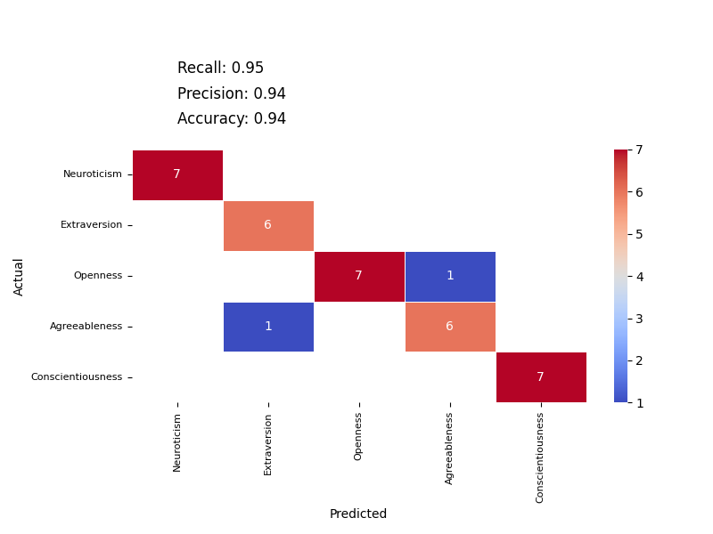
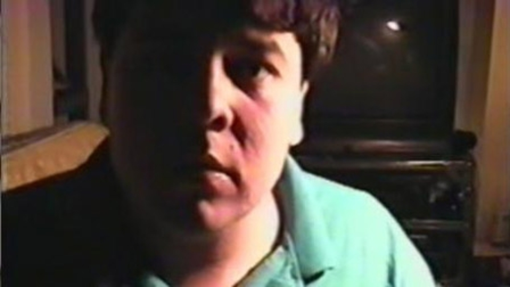
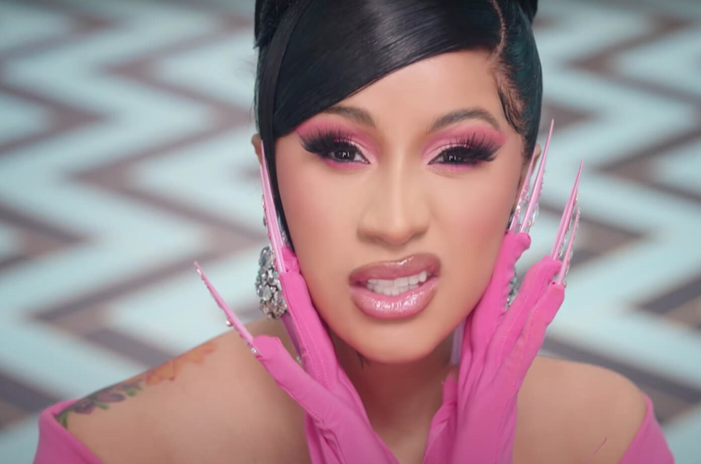

<p align="center">
  
</p>
 
# Automatic Classification of Personality
The purpose of this work is the development of an automatic tool for measuring attachment styles, personality patterns and traits for forensic, intelligence gathering, marketing, and research purposes.
   
Pre-release Article: https://drive.google.com/file/d/1Wp6e4hdgtclTr-EdfWJk93wfvaYdq-BH/view?usp=sharing
   
## Description
This work presents an innovative AI-based tool that can automatically analyze complex dialogues and speaker interactions to identify each person's attachment style and personality patterns. The tool utilizes natural language processing and language models like GPT with Prompt Engineering to perform this in-depth analysis.     
    
Key points:   
   
1) It can accurately classify the text of dialogues into different attachment styles (secure, anxious, avoidant, and fearful) and personality patterns for each speaker, based on established psychological theories.   
   
2) The tool analyzes the emotional context, language style, interpersonal dynamics, and content of the dialogues to determine the underlying attachment styles and personality traits being expressed by each participant.   
   
3) It has demonstrated high accuracy in classifying sample dialogue excerpts and character interactions into the correct attachment styles and personality patterns.   
    
4) The tool provides an objective, efficient, and potentially unbiased way to assess complex psychological constructs like attachment and personality from natural conversations and speaker interactions.   
    
5) It can analyze lengthy, complex dialogues over time to track how attachment styles and personalities evolve through the interactions.   
   
In summary, this AI tool automates the analysis of rich dialogue data and speaker interactions to accurately identify each person's attachment style and personality patterns in an objective and unbiased manner, offering a transformative approach to understanding these psychological aspects.   

## Technical Description
The model analyzes the dialogues of each character and calculates a probability score from 0 to 1 for how well their speech matches each of the four attachment styles (secure, anxious, avoidant, etc.). A score of 1 means the character's dialogues perfectly fit that attachment style, while 0 means there is no match at all. The model performs this analysis separately for predefined segments of the dialogues. At the end, each character is assigned a specific attachment style based on their overall dialogue, using the calculated probability scores. The output shows how each character's assigned attachment style changes over the course of the dialogue segments or series episodes. This output data can be visualized on a graph to easily see the shifts in attachment styles as the interactions progress.   
   
In summary, the model calculates probability scores for how well each character's dialogues match the different attachment styles, analyzes this over segments, and ultimately assigns styles to characters while tracking changes over time that can be visualized.   
   
## Validation: 
To validate the model's accuracy, we tested it on sentences/items from established attachment style questionnaires like the ASQ and RSQ.   
We had a total of 68 sentences, each corresponding to one of the four attachment styles (secure, anxious, avoidant, etc.).   
For each sentence, we asked the model to classify which attachment style that sentence best represented. For example: "My desire to merge completely sometimes scares people away" should be classified as the "preoccupied" attachment style.   
we then compared the model's classifications to the actual correct classifications from the questionnaires.   
To evaluate performance, we used a confusion matrix - a table that shows correct and incorrect classifications.   
For good classification capabilities, the model should correctly classify most or all of the 68 sentences into their proper attachment styles.   
In this case, the model achieved 100% accuracy by correctly classifying all 68 sentences into their correct attachment styles based on the questionnaire answers.   

In summary, validating on standard questionnaire sentences showed the model could accurately classify attachment style statements with 100% accuracy compared to the expected classifications, demonstrating its high performance.   

<p align="left">
  
</p>
    
We did the same to validate the Big Five traits. For this purpose, we gave the model sentences or items where each of them belongs to one of the five traits. We have a total of 35 items from the NEO-PI-R questionnaire. The model was able to correctly identify about 95% of the items, that is, 33 out of 35.
<p align="left">
  
</p>

When it comes to validating the personality patterns it becomes more complex to interpret. we have a total of 78 items from the SWAP-200 Assessment Procedure. First, the items of Depressed, Anxious-Avoidant, and Dependent-Victimized are under one category of items called Dysphoria, so they are united into one pattern as they have the same items in common. Second, there are correlations between the different items and between the patterns. For example, there is a high correlation between a histrionic personality and a narcissistic personality, or between a paranoid personality and an antisocial personality. These correlations result in the simultaneous prediction of several patterns for an item. It must be remembered that personal patterns can be embodied simultaneously in the same subject, so the results must be interpreted accordingly. On the one hand, we don't want to arbitrarily impose a certain personality disorder on someone, and on the other hand, we also don't want to miss someone who have a high rating in a certain personality disorder. At this stage of development, precision is more relevant to us here because we want it to give a rating score for a certain pattern with highest confidence as possible. the precision level we achieved is about 80%.
<p align="left">
  
</p>  
     
## Main GUI and Options:
<p align="left">
  
</p>

It is possible to analyze different types of inputs. The personality patterns analysis can be performed in three ways: one option is an analysis of scenes and dialogues of multiple speakers, a second option is analyzing media contents concentrated in a folder, and a third option is of analyzing a single video file. 

<p align="left">
  
</p>


<p align="left">
  
</p>

## Dialogue File:
1. We start with a video file or a movie from which we want to extract dialogues. Through a transcription process, we convert the auditory speech of the characters into text. This transcribed dialogue will serve as the primary input for our analysis. this is mainly done with AzureSpeech2SRT.py that can perform speaker diarization to recognize different speakers from audio.
2. Then we insert the transcribed dialogue into the GPT model, alongside Bartholomew's definitions of attachment styles from the article - Attachment styles among young adults: A test of a four-category model (1991).
3. The model calculates the probability of each piece or segment of dialogue or text for each of the four  attachment styles. The number of segments is predefined (less segments = analysis of more text per segment).
4. We instruct the model to produce a specific output. In this case, for each piece of dialogue or text, we want the model to assign each speaker or character a probability (from 0 to 1) for each attachment style. A score of 1 means that the dialogue perfectly matches a particular attachment style, and 0 means that there is no match at all.
5. After processing all parts of the dialog or text, the model produces a data set such as a CSV file that includes the probabilities for each attachment style for each part of the dialog or text. This data can then be visualized on a graph to examine changes in attachment styles over the film's timeline. This way we will get a dynamic description of the attachment styles of the characters during the film.

## Results: Scenes From A Marriage (Attachment Styles)
We have a data file that displays results for a series with 5 episodes. We are analyzing the relationship between two main characters, Jonathan and Mira, focusing on their attachment styles during different dialogue segments. There are graphs that show the attachment styles distributed over approximately 25 segments. The top graph depicts Jonathan's attachment styles, and the bottom one shows Mira's. Each graph includes timecodes on the X-axis and the attachment styles on the Y-axis, with key values highlighted in a thicker line. Colors on the graphs correspond to different attachment styles. For example, when Jonathan exhibits an avoidant attachment style, Mira often shows an anxious style, and vice versa. This analysis helps us understand how each character's attachment style interacts over the course of the series.   

<p align="left">
  
</p>

In the next image we can see a correlation table for the main characters in the movie Jonathan and Mira. It can be seen that there is a significant moderate correlation (p-value<0.001, r=0.41) between time points characterized by anxious attachment on the part of Jonathan and time points characterized by avoidant attachment on the part of Mira. It can also be seen that there is a significant medium-weak correlation (p-value<0.001 r=0.32) between time points characterized by avoidant attachment on the part of Jonathan and time points characterized by anxious attachment on the part of Mira.

<p align="left">
  
</p>

### Media Folder:
SOTA vision models can extract and analyze images or videos from social media profiles to identify visual features such as appearance, actions, and emotions. By analyzing these features across various photos or videos, we can infer personality traits based on the subject’s choices in attire, location, and activities. For instance, frequent photos at social events and vibrant clothing choices might suggest extroversion and openness. However, the accuracy of these analyses depends on the available data, and results are not absolute, reflecting only what the individual chooses to display publicly.

How the algorithm works:
1. Selecting input folder:
Selecting a folder that contains images or videos of the same person.
2. Getting descriptions:
Using AI to extract descriptions (in a csv file format) for each image or video file, that is: general description of the person, actions, objects, locations, clothing, and expressed emotions - using strict instructions or prompts.
3. Analyzing the descriptions:
Getting results using AI with tailored knowledge for the text with the descriptions of all images and videos from the selected folder.

## Video File:
If we want to analyze a single video file, when only one person appears and speaks in it, we will select this option. For example, when a person is interviewed and answers questions in a specific video clip. This algorithm is less "smart" compared to the one that analyzes scenes, in that it does not know how to separate speakers. In fact, it sees only one speaker before its eyes with one concentrated transcription. Therefore, it is not intended for analyzing videos that clearly contain more than one speaker. The algorithm relies on what the speaker in the video says, and extracts the results of his or her personality from a transcript it extracts from the audio of the video file. To make sure that only one speaker is actually heard in the video segment, it is recommended to edit it and remove speakers that are not relevant, and highlight only the speaker we want to analyze.

How the algorithm works:
1. Selecting input Video
Selecting a video with one speaker.
2. Video to text:
Transcribing the video into text using AI.
3. Analyzing the text:
Getting results using AI with tailored knowledge by using the transcription of the video.

## The Case of Elliot Rodger
<p align="left">
  
</p>
Elliot Rodger was a 22-year-old man known for perpetrating the Isla Vista massacre near the University of California, Santa Barbara, on May 23, 2014. He killed six people and injured fourteen others before committing suicide. His actions were motivated by personal and social grievances, particularly his frustration over his perceived social and sexual rejection by women. Rodger left behind a manifesto and a series of YouTube videos detailing his thoughts and plans, which sparked widespread discussion about various social issues, including misogyny, mental health, and gun control laws. In order to implement the system, we would like to input, for example, transcribed textual content into the algorithm. This textual content does not come from a video file, but from a book written by Eliot Roger himself about himself - a biographical book. these are the output results:    

#### Attachment Styles:    
Secured: 0.1   
Anxious-Preoccupied: 0.3    
Dismissive-Avoidant: 0.1   
Fearful-Avoidant: 0.5   
Sentiment: -0.8   
Emotionality: 9   
Self: -10 | Others: -10   
Anxiety: 8   
Avoidance: 8   
   
Explanation: The dominant attachment style is Fearful-Avoidant, characterized by a negative view of both self and others, and a high level of anxiety and avoidance. Rodger expresses intense loneliness and a sense of rejection, coupled with a strong desire for acceptance and intimacy, yet simultaneously avoids and fears these very connections. He also demonstrates considerable anxiety about relationships and a profound avoidance of genuine intimacy.   
   
Sentence: "I am the true victim in all of this. I am the good guy. Humanity struck at me first by condemning me to experience so much suffering."   
   
#### Personality Disorders (according to Westen, Shedler, Bradley, and DeFife's taxonomy):   
Depressed: 3   
Paranoid: 4   
Schizoid-Schizotypal: 1   
Antisocial-Psychopathic: 4   
Borderline-Dysregulated: 3   
Narcissistic: 4   
Anxious-Avoidant: 3   
Dependent-Victimized: 2   
Obsessional: 1   
Hysteric-Histrionic: 1   
Sentiment: -0.8   
Emotionality: 9   
Depression: 0.9   
   
Explanation: Rodger's narrative shows a high match with Paranoid (4), Antisocial-Psychopathic (4), and Narcissistic (4) personality disorders. His deep mistrust, hostility towards others, and belief in widespread conspiracy against him align with Paranoid traits. His lack of empathy, manipulative and harmful behavior towards others, and grandiose sense of self-importance are indicative of Antisocial-Psychopathic and Narcissistic disorders.   
    
Sentence: "Humanity has never accepted me among them and now I know why. I am more than human. I am superior to them all. I am Elliot Rodger… Magnificent, glorious, supreme, eminent… Divine!"    
   
#### Big Five Personality Traits:   
Extraversion: -8   
Agreeableness: -10   
Conscientiousness: 2   
Neuroticism: 10   
Openness: -1   
Sentiment: -0.8   
   
Explanation: Rodger exhibits low Extraversion, extremely low Agreeableness, moderate Conscientiousness, high Neuroticism, and low Openness. His introversion, antagonistic view towards others, adherence to specific plans, emotional instability, and closed-mindedness are evident throughout the text.   
         

#### Overall, it is not possible to determine with certainty whether such a person will carry out the murder spree after writing this book, but from the results it is possible to notice very high and even extreme parameters. For example, very negative sentiment, very negative attitudes towards the self and the others, very high anxiety and avoidance, high levels of antisociality, together with narcissism, very high emotionality, high level of depression, extremely low agreeableness, as well as extreme neuroticism. All of this should turn on red lights for us regarding the person and his personality that is embodied through this textual source.

     
## Ricardo Lopez "Björk stalker"
<p align="left">
  
</p>
Ricardo Lopez, known as the "Björk stalker," was an Uruguayan-American known for his extreme obsession with Icelandic singer Björk. His obsession culminated in 1996 when he constructed a letter bomb to harm her. Before committing suicide on the day he mailed the device, Lopez filmed himself, leaving behind a video diary that detailed his disturbed mindset and plans. His case is often cited in discussions about the dangers of celebrity stalking and mental health issues. We collected about 20 videos of Lopez filming himself and talking to the camera ("The Video Diary of Ricardo Lopez"). The duration of each video is about an hour, a total of about 20 hours of raw footage. We transcribed the videos and entered the transcript into the algorithm. The transcription from "The Video Diary of Ricardo Lopez" is extensive and covers various topics, including his plans, thoughts, and intentions. This provides a deep insight into his mental state and personality.
           
#### Attachment Styles:    
Secured: 0.05   
Anxious-Preoccupied: 0.15   
Dismissive-Avoidant: 0.15   
Fearful-Avoidant: 0.65   
Sentiment: -0.8   
Emotionality: 8   
Self: -7 | Others: -8   
Anxiety: 6   
Avoidance: 5   
     
Explanation: The text reveals a high level of anxiety and avoidance, particularly in the context of social relationships and self-perception. The predominant fearful-avoidant attachment style is evident in his expressed discomfort with closeness, yet a desire for intimacy, accompanied by mistrust and fear of rejection.   
     
#### Personality Disorders (according to Westen, Shedler, Bradley, and DeFife's taxonomy):   
Depressed: 2   
Paranoid: 2   
Schizoid-Schizotypal: 2   
Antisocial-Psychopathic: 3   
Borderline-Dysregulated: 3   
Narcissistic: 2   
Anxious-Avoidant: 3   
Dependent-Victimized: 2   
Obsessional: 1   
Hysteric-Histrionic: 1   
Sentiment: -0.8   
Emotionality: 8   
Depression: 0.7   
     
Explanation: The high rating for Antisocial-Psychopathic is due to the presence of manipulative, reckless, and harmful behaviors towards others. The Borderline-Dysregulated rating reflects intense emotions and instability in self-image.    
Sentence: "My main objective is to end my life. Now, as I'm going down, I'm going to screw her up. (Björk)"   
    
#### Big Five Personality Traits:   
Extraversion: -5   
Agreeableness: -8   
Conscientiousness: 3   
Neuroticism: 9   
Openness: 4   
Sentiment: -0.8   
     
Explanation: The negative rating in Extraversion and Agreeableness aligns with the text's antisocial and hostile tone. High Neuroticism is evident through anxiety and emotional instability, while some level of Conscientiousness and Openness is seen in the methodical planning and some intellectual engagement.   

#### Overall, we identify high parameters such as a very negative sentiment, a high level of emotionality, a negative attitude towards the self and others, some signs of borderline and antisocial personality, depression, and very high neuroticism. Note that obsessive personality was given a score of 1, because his obsession with the singer is not indicative of an obsessive personality in general, and that obsessive personality has clear, distinct definitions. If we also watch some of the videos and listen to what he says, it seems that his personality is unstable in terms of his attitude towards himself and others. On the one hand he calls himself a pig, on the other he flatters himself. On the one hand, he sees the singer as an "angel", who should be worshipped, and on the other hand, he shows great anger towards her at other times in a very extreme way. These extreme changes may indeed express a borderline personality to one degree or another. This is mainly as a way of the instability of his attitude towards the "self" and the intensity of the emotional dysregulation. Therefore, the algorithm correctly identifies the borderline personality here or the expression of it.   


## Franz Kafka's letter to his father
<p align="left">
  
</p>
Franz Kafka's letter to his father, commonly referred to as "Letter to His Father," is a lengthy and personal document in which Kafka confronts the profound impact his father, Hermann Kafka, had on his life and psyche. In the letter, Kafka accuses his father of emotionally abusing him, which he believes led to his feelings of inadequacy and insecurity. The letter details how Hermann's authoritarian and intimidating demeanor deeply affected Kafka's self-esteem, his relationships, and his writing. However, Kafka also expresses understanding of his father's behavior, considering his background and own upbringing. The letter was never actually sent to Hermann Kafka. Based on the text from Franz Kafka's letter to his father, the following analysis can be made regarding attachment styles, personality disorders, and Big Five personality traits:
    
#### Attachment Styles:    
Secured: 0.10   
Anxious-Preoccupied: 0.45   
Dismissive-Avoidant: 0.10    
Fearful-Avoidant: 0.35    
Sentiment: -0.6    
Emotionality: 8    
Self: -7 | Others: -5   
Anxiety: 7   
Avoidance: 3     
    
Explanation: The text reflects a high level of anxiety and moderate avoidance, which is indicative of an Anxious-Preoccupied attachment style. Kafka expresses a longing for acceptance and affection, coupled with fear and anxiety about his relationship with his father.   
    
Sentence: "I was a timid child... I could not control myself, could not keep the words back, I was sorry even while I was saying them."   
   
#### Personality Disorders (according to Westen, Shedler, Bradley, and DeFife's taxonomy):    
Depressed: 3   
Paranoid: 1   
Schizoid-Schizotypal: 1   
Antisocial-Psychopathic: 0   
Borderline-Dysregulated: 2   
Narcissistic: 1   
Anxious-Avoidant: 3    
Dependent-Victimized: 3   
Obsessional: 1   
Hysteric-Histrionic: 1   
Sentiment: -0.6  
Emotionality: 8   
Depression: 0.7  
     
Explanation: Kafka's letter indicates high levels of depression, anxious-avoidant, and dependent-victimized traits. His intense emotional expression, sense of helplessness, and longing for a better relationship with his father highlight these aspects.      
     
Sentence: "What I would have needed was a little encouragement, a little friendliness, a little keeping open of my road, instead of which you blocked it for me."     
      
#### Big Five Personality Traits:    
Extraversion: -8    
Agreeableness: -5   
Conscientiousness: 4   
Neuroticism: 8   
Openness: 6   
Sentiment: -0.6   
    
Explanation: Kafka shows high introversion, moderate antagonism, conscientiousness, very high neuroticism, and above-average openness. His introspective and analytical nature, combined with emotional instability and creativity, is evident in the letter.   


## Yahya Sinwar
 <p align="left">
  
</p>
We extracted about 200 images of Yahya Sinwar and analyzed them. Yahya Sinwar, born in 1962 in Khan Younis, Gaza Strip, considered as the leader of Hamas in the Gaza Strip. His upbringing in a refugee camp shaped his early involvement in Palestinian nationalism and Islamism, leading to his significant role in founding Hamas's security apparatus. Known for his charismatic yet ruthless persona, he has been pivotal in Hamas operations, including orchestrating attacks against Israel and advocating for the capture of Israeli soldiers. His tenure has seen a mix of violent confrontations and brief openings towards "peaceful, popular resistance", reflecting his complex leadership style in the context of the Israeli-Palestinian conflict. Yahya Sinwar's personality is a blend of charisma, intellectual depth, and ruthlessness, elements that have significantly contributed to his leadership style and his influence within Hamas and the broader Palestinian resistance movement.    
    
    
Output Results:    
It appears that the person in the images is a middle-aged man who is often seen in formal or semi-formal attire. He frequently participates in public speaking engagements, indicating that he might be a figure of authority or influence, potentially in politics or activism. His clothing often includes suits, shirts, and sometimes traditional scarfs known as keffiyehs, which suggests that he may hold a cultural or political position, possibly in a Middle Eastern context given the presence of Arabic text in many settings. His emotional state during these events is typically serious, passionate, or focused—common for individuals engaged in matters of importance or concern. The presence of media suggests that his statements are of public interest, and the themes of the various events involve political or social matters.    
From a psychological perspective, based on the information provided in the images, it would seem the person has a dominant personality, capable of leading and commanding attention. He tends to display confidence, assertiveness, and engagement with social issues. Meeting such a person would likely be an encounter with someone who is serious and passionate about his beliefs and causes, someone who is persuasive and can rally people around those causes. The man's profession could likely be a political leader, activist, or a figure with a significant role in societal affairs, given his recurrent participation in public speaking events, rallies, and formal gatherings.    
    
### Attachment Style   
Secured: 0.2   
Anxious-Preoccupied: 0.1   
Dismissive-Avoidant: 0.4   
Fearful-Avoidant: 0.3   
Sentiment: 0.2   
Emotionality: 6   
Self: 7 | Others: 5   
Anxiety: 3   
Avoidance: 6   
   
Explanation: The selected probabilities reflect the man's public persona and leadership role. His likely confidence in his self-view and the strategic avoidance of intimate disclosure common to public figures suggest a Dismissive-Avoidant attachment style. He engages with the public when necessary but maintains a degree of emotional distance appropriate to his position. A significant probability is also given to the Fearful-Avoidant style due to the potentially high-pressure situations he finds himself in and the need for a wary approach to others' intentions in political or activist realms.      
    
### Personality Disorders (according to Westen, Shedler, Bradley, and DeFife's taxonomy):   
Depressed: 0   
Paranoid: 1   
Schizoid-Schizotypal: 0   
Antisocial-Psychopathic: 2   
Borderline-Dysregulated: 0   
Hysteric-Histrionic: 0   
Narcissistic: 3   
Anxious-Avoidant: 2   
Dependent-Victimized: 1   
Obsessional: 0   
Depression: -0.5   
   
Explanation: The Narcissistic rating reflects the possibility that a person in such a public role with clear leadership status, influence, and frequent interactions with the press may exhibit traits aligned with grandiosity or self-importance, and possibly lack of empathy necessary for navigating political strife. However, this is a cautious speculation, as such traits can often simply reflect the persona adopted by public figures rather than a disorder. The rating for Anxious-Avoidant acknowledges the intense strain from the demands of public life and underlying anxiety that could be present.   
   
### Big Five Personality Traits:   
Extraversion: 8   
Agreeableness: 6   
Conscientiousness: 8   
Neuroticism: 4   
Openness: 7   
   
Explanation: The ratings reflect a personality profile of someone who is outgoing and assertive (Extraversion), reasonably cooperative (Agreeableness), very organized and driven (Conscientiousness), somewhat prone to stress in high-stakes environments (Neuroticism), and open to experience in engaging with diverse crowds and situations (Openness).   
   
**Please note**: These assessments are based on limited data and should not be used to speculate about the true personality or psychological profile of the person depicted in the images. The suggestions made here are for illustrative purposes and do not represent a definitive personality or psychological diagnosis.   
   
## Cardi B
 <p align="left">
  
</p>
We extracted about 300 images of the singer Cardi B and analyzed them. Cardi B, born Belcalis Marlenis Almánzar on October 11, 1992, in The Bronx, New York, is a Grammy Award-winning American rapper, songwriter, and actress known for her candidness, humor, and vivacity. Her music often incorporates her experiences, tackling themes of empowerment, wealth, and relationships, delivered with her signature flow and Bronx accent. Personality-wise, Cardi B is known for her unfiltered and straightforward demeanor, often using her platform to express her opinions on various social and political issues. Her humor and authenticity have endeared her to a wide audience beyond her music career. She's outspoken about her past as a stripper and uses her story to advocate for female empowerment and sex positivity.   
   
Output Results:   
It seems like the person is a female who has been photographed in different settings, primarily at formal events and red carpet occasions. She is often described as posing for the camera, suggesting that she has experience with media and public appearances. Her attire varies from elegant gowns to casual and glamorous outfits, indicating versatility and an interest in fashion. She is frequently seen as being confident and composed, playful or engaging in performances, which may point to her being a performer or celebrity of some sort.   
From a psychological or psychiatric perspective, the consistent descriptions of her confidence and composure in various social settings could suggest a strong sense of self-assuredness and comfort in the public eye. Her playful interactions and posing for cameras could indicate someone who is extroverted and enjoys attention, which is often seen in personalities accustomed to or seeking the spotlight. Her varying clothing styles and colors could reflect a dynamic personality and a willingness to express herself through fashion. Her dominant emotional states of confidence, playfulness, and contentment suggest a positive self-image and a general satisfaction with her experiences, particularly in professional environments.   
Meeting and interacting with this person could be engaging and pleasant. She likely carries herself with poise and has the ability to hold attention, which could make for entertaining and interesting conversation, especially about fashion and entertainment. With her apparent comfort in public settings, she would likely be personable and comfortable engaging with others.   
Her profession could potentially be in the entertainment industry; possibly a singer, actress, or public figure who attends various media events and may perform live, indicated by the repeated presence of a microphone and a stage in several scenes.   
   
### Attachment Styles   
Secured: 0.4   
Anxious-Preoccupied: 0.2   
Dismissive-Avoidant: 0.3   
Fearful-Avoidant: 0.1   
Sentiment: 0.1   
Emotionality: 4   
Self: -2 | Others: 2   
Anxiety: 2   
Avoidance: 3   
   
Explanation: Higher security reflects a baseline interest in the environment and people, suggesting a balanced and somewhat optimistic engagement, despite mild anxiety and avoidance tendencies.   
   
### Personality Disorders (according to Westen, Shedler, Bradley, and DeFife's taxonomy)   
Depressed: 1   
Paranoid: 1   
Schizoid-Schizotypal: 1   
Antisocial-Psychopathic: 1   
Borderline-Dysregulated: 1   
Hysteric-Histrionic: 2   
Narcissistic: 2   
Anxious-Avoidant: 2   
Dependent-Victimized: 1   
Obsessional: 1   
Depression: -0.5   
   
Explanation: Moderate ratings for Hysteric-Histrionic and Narcissistic suggest a focus on appearance or superficial details, possibly reflecting a certain level of preoccupation with external validation or image.   
   
### Big Five Personality Traits:   
Extraversion: 4   
Agreeableness: 2   
Conscientiousness: 3   
Neuroticism: 2   
Openness: 4   
   
Explanation: Higher openness and extraversion suggest a willingness to explore and engage with both social and physical environments, underscored by a conscientious approach, albeit with some underlying tension or nervousness.   
   


## Requirements:
- Please set in the config.py your OpenAI API key.
- For transcribing and getting an SRT captions file with speakers using speaker diarization, please specify in the AzureSpeech2SRT.py all the required fields. this will require to open an Azure Service account and setting up the needed credentials.
- Please make sure the packages in requirements.txt are installed with the latest versions.
- Transcribing a video file is using ffmpeg, which is no included. please make sure it is installed. you can download it from here: https://ffmpeg.org/download.html than, set the path in config.py (ffmpeg_path = "PATH_TO/ffmpeg/bin")
- For visual analysis, an OCR model is available as an option but is dependent on Pytesseract which is available for download from https://github.com/tesseract-ocr/tesseract, otherwise, some errors may accord. the default installation folder is C:\Program Files\Tesseract-OCR\tesseract.exe and is set in config.py.

- It is recommendod to use python <3.12 for optimal running, since torch and transformers packages does not currently support python 3.12. pytorch is used for transribng audio to text in the single video analysis.

```bash
git clone https://github.com/reab5555/Automatic-Classification-of-Personality.git
cd Automatic-Classification-of-Personality
pip install -r requirements.txt


